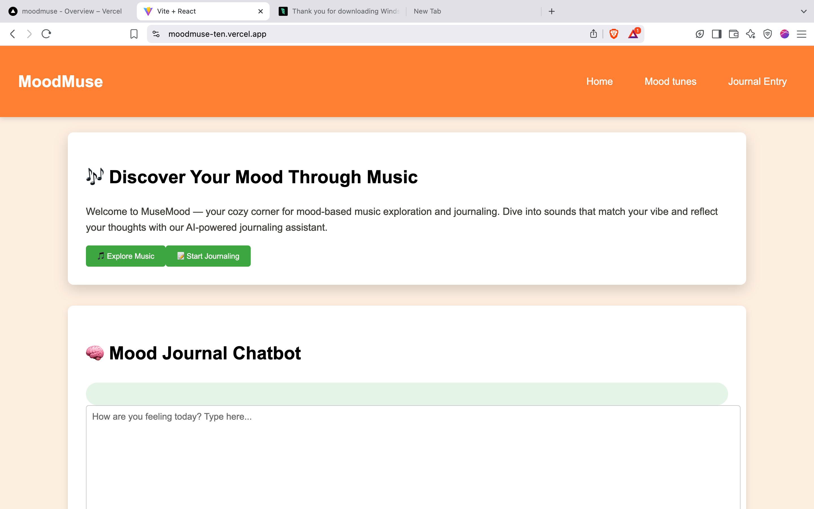
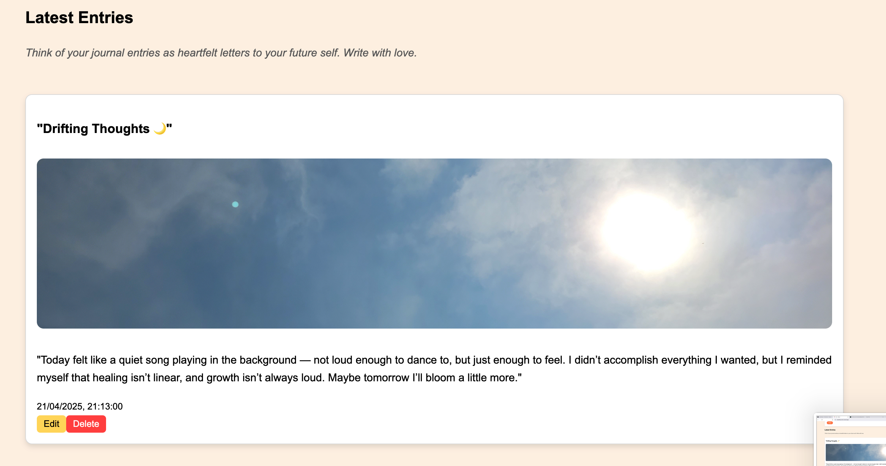
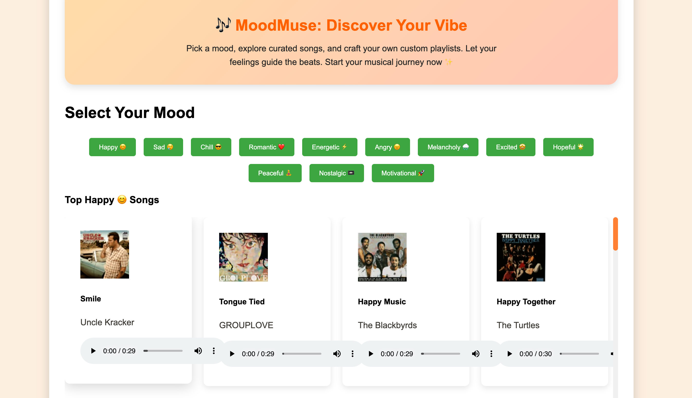
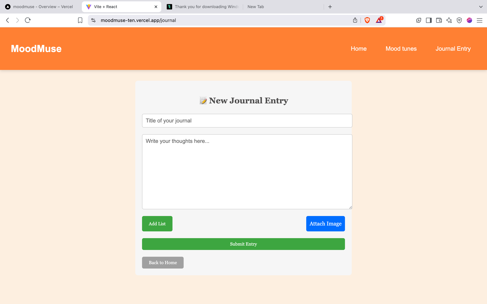

# MoodMuse 🎶🧠

## Description 🌟
Welcome to **MuseMood**, your cozy corner for **mood-based music exploration** and **introspective journaling**. 🎧📝  
This app helps you explore the perfect music based on your current mood and reflect on your feelings with the help of an AI-powered **mood journaling assistant**. The friendly chatbot will listen to your thoughts and offer thoughtful, empathetic responses, making journaling a more reflective and healing experience. 🌱💭

## Features ✨
- **🎵 Explore Music**: Find music that fits your mood. Whether you're happy, sad, or anywhere in between, MuseMood recommends songs that resonate with your emotions.
- **🧠 AI-Powered Mood Journaling**: The journaling assistant responds empathetically, helping you explore your feelings deeper.
- **📝 Create and Edit Journal Entries**: Easily add, edit, or delete your journal entries. Reflect on past entries and see how your mood has evolved.
- **🌍 User-Friendly Interface**: Clean, easy-to-navigate design to keep you focused on what matters most—your feelings.
- **🔄 Persistent Journal**: Your journal entries are saved and can be revisited anytime to track your emotional journey.

## Tech Stack 💻
- **Frontend**: 
  - React.js ⚛️
  - Vite (for fast build & development) 🚀
  - HTML5, CSS3, JavaScript
  - React Router (for navigation)
- **Backend**: 
  - OpenRouter API (AI assistant for mood journaling) 🤖
- **Version Control**: 
  - Git (with GitHub for repository management) 🧑‍💻


## Pages & Features Breakdown 🚀

### **1. Homepage (Home.jsx)** 🏡
- **Purpose**: The main landing page with an introduction to **MuseMood**.
- **Sections**:
  - **Hero Section**: Includes a welcome message and navigation buttons to explore music or start journaling.
  - **Mood Journal Chatbot**: Users can interact with an AI assistant to reflect on their feelings.
  - **Latest Journal Entries**: Displays users' saved journal entries, with options to edit or delete.

---

### **2. Explore Music (Moods Page)** 🎵
- **Purpose**: Allows users to explore music based on their current mood.
- **Features**: Users can select a mood (e.g., happy, sad) and receive personalized music recommendations.

---

### **3. Journal Page (Submit.jsx)** 📝
- **Purpose**: Users can write and submit journal entries.
- **Sections**: Users enter a title and body, then submit the entry, which is saved and shown on the homepage.

---

### **4. Journal Entry Display** 📖
- **Purpose**: Displays saved journal entries with title, body, and date and photo attachments.
- **Features**: Users can edit or delete their entries as needed.

---

### **5. AI Mood Journal Chatbot** 🤖💬
- **Purpose**: Provides a conversational AI for users to explore their emotions.
- **How It Works**: Users type their feelings, and the AI responds empathetically, offering comfort and insights.

---

### **6. Persistent Journal Entries Storage** 💾
- **Purpose**: Keeps journal entries saved across sessions using localStorage.
- **Features**: Entries are persisted even after refreshing the page or revisiting the app.

---

### **7. Error Handling & UI Feedback** ⚠️
- **Purpose**: Ensures smooth user experience with loading indicators and user-friendly error messages in case of failures.

---

## Overall Flow 🧭
1. **Landing Page (Home)**: Users choose to explore music or start journaling.
2. **Mood Exploration**: Users explore music on the **Moods Page** based on their current feelings.
3. **Journaling**: Users create journal entries on the **Journal Page**, with the option to reflect with the AI assistant.
4. **Viewing Entries**: Saved journal entries are visible on the homepage, where users can edit or delete them.
5. **Persistent Data**: Entries are stored in **localStorage**, available across sessions.

---

## Tech Stack 🚀
- **Frontend**: React, Vite
- **State Management**: React Context API
- **AI Integration**: OpenAI (GPT-3.5 for mood journaling assistant)
- **Styling**: CSS (Styled Components or Regular CSS)
- **Data Storage**: localStorage

---

## Features ✨
- Mood-based music exploration 🎶
- AI-powered mood journaling assistant 🤖
- Journal entries with edit and delete functionality 📝
- Persistent data storage across sessions 💾

---

> ⚠️ **Note:**  
> The AI-powered mood journaling chatbot may **crash or stop responding** when **API credits run out**.  
> I'm actively working on improving this by integrating more stable or cost-efficient solutions. Thank you for your patience! 💙


## Setup Instructions ⚙️
1. **Clone the repository**:  
   `git clone https://github.com/your-username/musemood.git`

2. **Navigate to the project directory**:  
   `cd musemood`

3. **Install dependencies**:  
   `npm install`

4. **Set up environment variables**:
   - Create a `.env` file in the root directory.
   - Add your API keys (for OpenAI or Hugging Face) as follows:
     ```env
     VITE_OPENAI_API_KEY=your_openai_api_key
     ```

5. **Run the development server**:  
   `npm run dev`

6. Open `http://localhost:3000` in your browser.

---

## Commit Message Guidelines 📝
- Use meaningful commit messages that describe the changes you made.
  Example:
  - `Added AI mood journaling feature`
  - `Fixed bug in journal entry display`
  - `Styled the homepage layout`

---

## Screenshots 📸




---

Feel free to contact me for any questions or feedback! ✨


